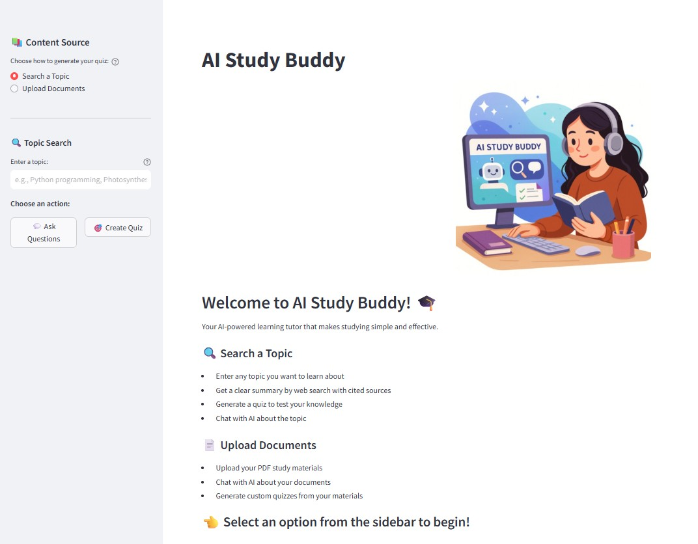

# AI Study Buddy

A Streamlit application powered by **LangChain** that uses Retrieval-Augmented Generation (RAG) with FAISS vector database to help you study and learn from multiple sources.



## Features

- **📚 Dual Learning Modes**: Search web topics or upload PDFs for personalized learning
- **🤖 Socratic AI Tutor**: Context-aware chat using FAISS semantic search with source citations
- **🎯 Smart Quizzes**: Auto-generated multiple-choice quizzes with instant feedback
- **🔍 RAG**: Web search integration, vector database, and intelligent text chunking

## How It Works

This application leverages **LangChain** and **FAISS** for advanced AI-powered learning:

1. **PDF Processing**: Uses LangChain's `PyPDFLoader` to extract text from uploaded documents
2. **Vector Database**: FAISS vector store with OpenAI embeddings for semantic search
   - Documents are split into optimized chunks using `RecursiveCharacterTextSplitter`
   - Each chunk is embedded using OpenAI's embedding model
   - FAISS indexes enable lightning-fast similarity search
3. **Semantic Retrieval**: Finds the most relevant content using vector similarity instead of keyword matching
4. **LLM Integration**: LangChain's `ChatOpenAI` (GPT-4) for natural language understanding and generation
5. **Web Search**: LangChain's `TavilySearchResults` for comprehensive web research
   - Web content is also indexed in the vector store for semantic search
6. **Conversational AI**: Message schemas (`HumanMessage`, `SystemMessage`) maintain conversation context
7. **Smart Generation**: AI uses semantically retrieved context to generate accurate, Socratic-style responses
8. **Quiz Generation**: Creates interactive multiple-choice quizzes by retrieving relevant content from the vector store


## Requirements

- Python 3.8+
- OpenAI API Key (for GPT-4 and embeddings)
- Tavily API Key (for web search functionality)

## Installation

1. Clone this repository:
```bash
git clone <repository-url>
cd ai-study-buddy
```

2. Install the required packages:
```bash
pip install -r requirements.txt
```

3. Create a `.env` file in the project root and add your API keys:
```bash
OPENAI_API_KEY=your_openai_api_key_here
TAVILY_API_KEY=your_tavily_api_key_here
```

4. Run the Streamlit app:
```bash
streamlit run app.py
```

## Usage

1. Open the application in your web browser (typically at http://localhost:8501)
2. Ensure your OpenAI and Tavily API keys are set in the `.env` file or enter them in the sidebar

### 🔍 Learning from Topics
3. Select **"Search a Topic"** in the sidebar
4. Enter any topic you want to learn about
5. Click **"💬 Ask Questions"** to chat with AI about the topic
6. Or click **"🎯 Create Quiz"** to generate a quiz about the topic

### 📄 Learning from Documents
3. Select **"Upload Documents"** in the sidebar
4. Upload one or more PDF files
5. Click **"💬 Ask Questions"** to chat about your documents
6. Or click **"📝 Create Quiz"** to generate a quiz from your documents